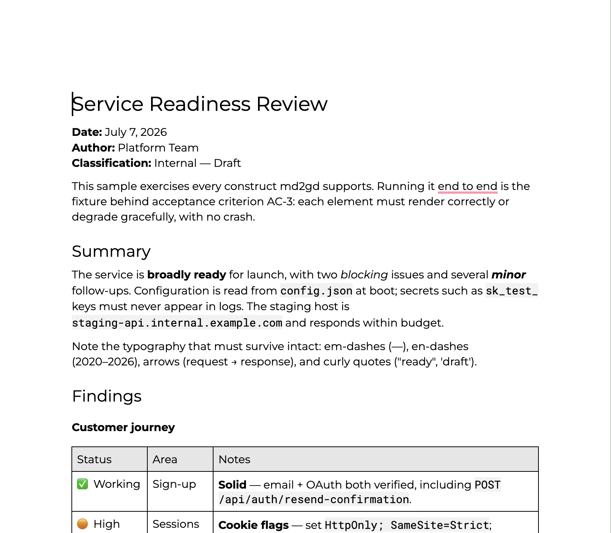

# md2gd

[](https://github.com/cniska/md2gd/actions/workflows/ci.yml)
[](https://github.com/cniska/md2gd/releases)
[](LICENSE)

Convert a Markdown file into a professionally styled Google Doc from the command line.

```
md2gd ~/notes/report.md
# → https://docs.google.com/document/d/…/edit
```

One command turns a Markdown file into a cleanly styled Google Doc in your Drive — proper heading hierarchy, readable spacing, styled tables with padded cells and a shaded header row, monospace code, and working links. The document never leaves your own Google account.



*The bundled [`examples/sample.md`](examples/sample.md) rendered by md2gd.*

## Why

I write long-form reports in Markdown, then need them as polished, shareable Google Docs. That last step is the slow one. Pasting or exporting through HTML mangles exactly what matters in a report: tables lose their structure, spacing collapses, code and headings need reflowing. You end up fixing the document by hand instead of writing it.

md2gd removes that step. One command, the same clean styling every time, and the file never leaves your own Drive.

## Requirements

- macOS or Linux
- A Google account

The prebuilt binary bundles its runtime, so that's all you need to run md2gd.

*Building from source additionally needs [Bun](https://bun.sh) 1.3+.*

## Install

### Prebuilt binary

```
curl -fsSL https://raw.githubusercontent.com/cniska/md2gd/main/scripts/install.sh | sh
```

Downloads the latest release binary for your platform into `~/.local/bin` and verifies its checksum — no Bun required. (Available once a release is published.)

To update, re-run the same command — it always fetches the latest release.

### From source

Requires [Bun](https://bun.sh) 1.3+.

```
git clone https://github.com/cniska/md2gd.git
cd md2gd
bun install
bun link        # exposes `md2gd` on your PATH
```

You can also run it without linking via `bun run src/cli.ts <file.md>`.

Once set up (see below), try it on the bundled sample: `md2gd examples/sample.md`.

## One-time Google setup

Creating a Doc in your Drive is a per-user write, so Google requires an OAuth login — there is no API-key shortcut. This is a one-time, ~5-minute setup.

1. Open the [Google Cloud Console](https://console.cloud.google.com/) and create (or pick) a project.
2. Enable two APIs for the project: **Google Docs API** and **Google Drive API** (APIs & Services → Library).
3. Configure the **OAuth consent screen**: user type **External**, fill in the required fields, and **publish it to Production**. Leaving it in "Testing" makes Google expire your login after 7 days.
4. Under **Credentials → Create credentials → OAuth client ID**, choose application type **Desktop app**. Download the resulting `client_secret.json`.

md2gd requests only the `drive.file` and `documents` scopes — it can see and touch only the files it creates, never the rest of your Drive.

## Authenticate

Run once, pointing at the file you downloaded:

```
md2gd init --client ~/Downloads/client_secret.json
```

Your browser opens for consent. Approve it, and the token is cached locally. After this, conversion is pure command-line — the access token refreshes silently.

## Usage

```
md2gd <file.md> [--title <title>] [--open]
md2gd <file.md> --update [<url|id>] [--title <title>] [--open]
```

- `--title <title>` — override the document title (defaults to the file's top `# H1`, else its filename).
- `--update [<url|id>]` — re-render into an existing doc instead of creating a new one (see below).
- `--open` — open the doc in your browser afterwards.
- `md2gd --help` / `md2gd --version`.

Generated docs are placed in an `md2gd` folder in your Drive. By default each run creates a new document and prints its URL.

## Updating a doc in place (stable URL)

The usual loop is *edit the Markdown, regenerate the Doc*. `--update` re-renders into the **same** document so its URL, Drive location, and any shares stay put:

```
md2gd ~/notes/report.md            # first run — creates the doc, remembers it
md2gd ~/notes/report.md --update   # re-renders into that same doc, same URL
```

With no argument, `--update` targets the doc md2gd previously created from that file (remembered in `~/.md2gd/config.json`). Pass an explicit target — a full Docs URL or a bare id — to override:

```
md2gd report.md --update https://docs.google.com/document/d/1AbC…/edit
```

A plain run (no `--update`) never overwrites: if a doc already exists for the file, md2gd still creates a new one and prints a reminder that `--update` would overwrite instead.

**Limits, by design:**

- md2gd can only update docs **it created** (it uses the narrow `drive.file` scope). Pointing `--update` at a doc you made by hand in the Docs UI fails with a clear message rather than editing it.
- Updating **clears and rewrites** the body. Google Docs **comments anchored to the old content will orphan**, and the rewrite is **not atomic** — an interrupted run can leave the doc partially rewritten. For the regenerate-a-report loop this is the right trade; for a heavily commented doc, prefer a fresh conversion.

## What it renders

Headings, **bold**/*italic*/~~strikethrough~~, `inline code` and fenced code blocks, links, ordered/unordered/nested and task lists, blockquotes, and tables (with sized columns, padded cells, and a shaded header row). Emoji and non-ASCII text are preserved. Horizontal rules (`---`) are intentionally ignored — heading spacing already separates sections.

Not yet supported (they degrade to readable text): images (rendered as their alt text), footnotes, and per-level markers for mixed-type nested lists.

## Configuration and credentials

md2gd stores everything in a user-scoped directory with owner-only permissions — `~/.md2gd/` on macOS, and `$XDG_CONFIG_HOME/md2gd` (default `~/.config/md2gd`) on Linux:

- `client_secret.json` — your OAuth client (copied in by `init`)
- `token.json` — the cached access/refresh token
- `config.json` — remembers which doc was created from each file, for `--update`

Nothing here is ever transmitted anywhere except Google's own APIs.

## Reset

To sign out, delete the cached token and re-run `init`; delete the whole directory for a full reset including the stored client secret:

```
# macOS
rm ~/.md2gd/token.json         # re-authenticate on next `md2gd init`
rm -rf ~/.md2gd                # full reset

# Linux
rm ~/.config/md2gd/token.json  # re-authenticate on next `md2gd init`
rm -rf ~/.config/md2gd         # full reset
```

## Contributing

Contributions are welcome — see [CONTRIBUTING.md](CONTRIBUTING.md). Run `bun run verify` before every commit.

## License

[MIT](LICENSE) © Christoffer Niska
